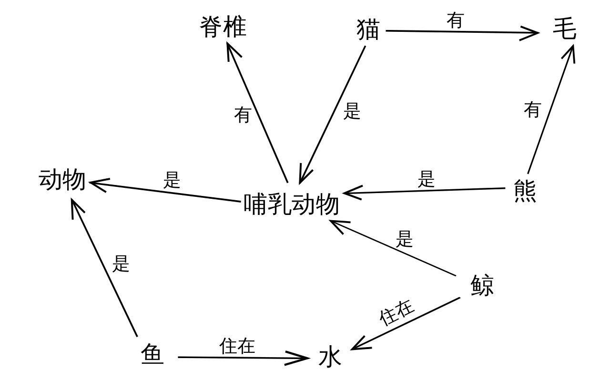
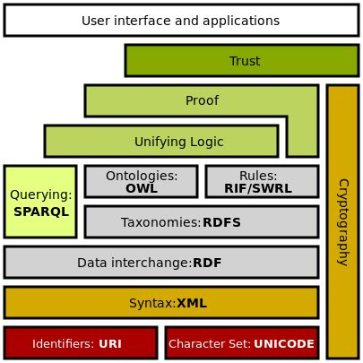
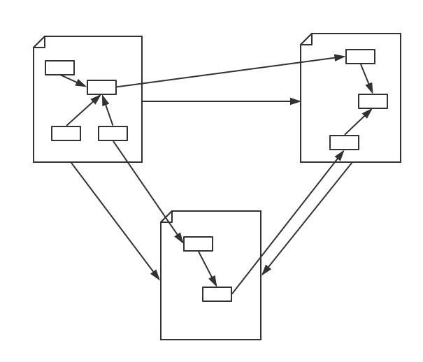
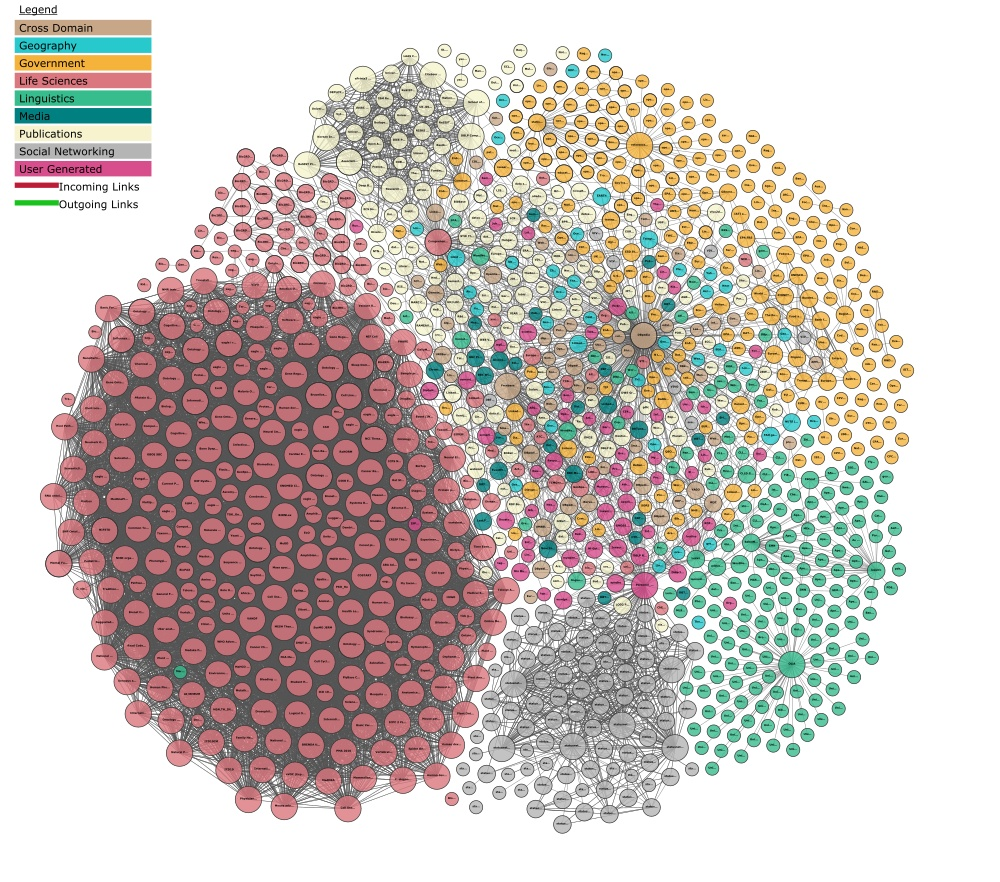
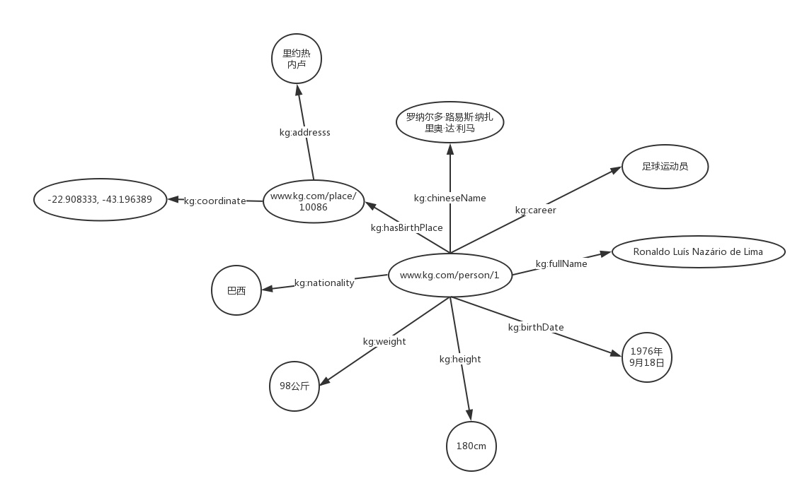

# 关于 ```语义Web``` 资料整理

## 前言

在 ```./assests/pdf/```有相应的pdf文件：

- [知识图谱标准化白皮书(2019)](http://www.cesi.ac.cn/201909/5589.html)

- [CodeWisdom平台API知识图谱服务系统全新上线了](https://mp.weixin.qq.com/s/8ReWM8AcN170LA8o6zjrsw)

- [知识图谱-给AI装个大脑](https://zhuanlan.zhihu.com/knowledgegraph)

- [https://open-services.net/](https://open-services.net/)

- [语义网国际会议网址](http://iswc.net)

相关软件：

- [Protege](https://protege.stanford.edu/) 本体编辑器

## 语义网络、语义网、链接数据和知识图谱

### 一、语义网络

语义网络是由Quillian于上世纪60年代提出的知识表达模式，其用相互连接的节点和边来表示知识。节点表示对象、概念，边表示节点之间的关系。



语义网络的优点：

1. 容易理解和展示。

2. 相关概念容易聚类。


语义网络的缺点：

1. 节点和边的值没有标准，完全是由用户自己定义。

2. 多源数据融合比较困难，因为没有标准。

3. 无法区分概念节点和对象节点。

4. 无法对节点和边的标签(label，我理解是schema层，后面会介绍)进行定义。

简而言之，语义网络可以比较容易地让我们理解语义和语义关系。其表达形式简单直白，符合自然。然而，由于缺少标准，其比较难应用于实践。看过上一篇文章的读者可能已经发现，RDF的提出解决了语义网络的缺点1和缺点2，在节点和边的取值上做了约束，制定了统一标准，为多源数据的融合提供了便利。另外，RDF对is-a关系进行了定义，即，rdf:type（是rdf标准中的一个词汇，之后的文章会介绍）。因此，不管在哪个语义网络中，表达is-a关系，我们都用rdf:type，在语法上形成了统一。比如上图中猫、熊与哺乳动物的关系就可以形式化的表达为：

> 猫 rdf:type 哺乳动物

> 熊 rdf:type 哺乳动物

但还有个问题，如何区分概念和对象？即定义Class和Object(也称作Instance, Entity)。如果不能区分，会对我们产生什么影响？举个例子，假如我们有两个语义网络A和B。在A中，熊是哺乳动物的一个实例。在B中，熊是哺乳动物的一个子类。前者是is-a关系，后者是subClassOf关系。这种情况常有发生，我们建模的角度不同，那么同一个事物的表示也可能不同。如果我们不能用一种方法来区别两者，不仅会给我们带来理解上的困难，在进行融合的时候也会造成数据冲突。我们不能说A既是B的一个实例，又是B的一个子类。W3C制定的另外两个标准RDFS/OWL解决了这个问题，如下图。



在语义网技术栈中，RDFS和OWL是RDF更上一层的技术，主要是为了解决语义网络的缺点3和缺点4，其提供了schema层的描述。在后续文章中，我们将更详细地介绍RDF，RDFS/OWL。在这里，读者只需要知道，通过RDFS或者OWL中的预定义词汇，我们可以形式化地声明一个类：

> 哺乳动物 rdf:type rdfs:Class

或

> 哺乳动物 rdf:type owl:Class

通过RDFS也可以声明一个子类：

>熊 rdf:type rdfs:Class

>熊 rdfs:subClassOf 哺乳动物

或者声明一个实例

> 熊 rdf:type 哺乳动物

我们也可以把rdf:type用a代替，即：

> 熊 a 哺乳动物

RDF，RDFS/OWL属于语义网技术栈，它们的提出，使得语义网克服了语义网络的缺点。

### 二、语义网（Semantic Web）和链接数据（Linked Data）

语义网和链接数据是万维网之父Tim Berners Lee分别在1998年和2006提出的。相对于语义网络，语义网和链接数据倾向于描述万维网中资源、数据之间的关系。其实，本质上，语义网、链接数据还有Web 3.0都是同一个概念，只是在不同的时间节点和环境中，它们各自描述的角度不同。它们都是指W3C制定的用于描述和关联万维网数据的一系列技术标准，即，语义网技术栈。

语义网是一个更官方的名称，也是该领域学者使用得最多的一个术语，同时，也用于指代其相关的技术标准。在万维网诞生之初，网络上的内容只是人类可读，而计算机无法理解和处理。比如，我们浏览一个网页，我们能够轻松理解网页上面的内容，而计算机只知道这是一个网页。网页里面有图片，有链接，但是计算机并不知道图片是关于什么的，也不清楚链接指向的页面和当前页面有何关系。语义网正是为了使得网络上的数据变得机器可读而提出的一个通用框架。“Semantic”就是用更丰富的方式来表达数据背后的含义，让机器能够理解数据。“Web”则是希望这些数据相互链接，组成一个庞大的信息网络，正如互联网中相互链接的网页，只不过基本单位变为粒度更小的数据，如下图。



链接数据起初是用于定义如何利用语义网技术在网上发布数据，其强调在不同的数据集间创建链接。Tim Berners Lee提出了发布数据的四个原则，并根据数据集的开放程度将其划分为1到5星5个层次。链接数据也被当做是语义网技术一个更简洁，简单的描述。当它指语义网技术时，它更强调“Web”，弱化了“Semantic”的部分。对应到语义网技术栈，它倾向于使用RDF和SPARQL（RDF查询语言）技术，对于Schema层的技术，RDFS或者OWL，则很少使用。链接数据应该是最接近知识图谱的一个概念，从某种角度说，知识图谱是对链接数据这个概念的进一步包装。本专栏的头像，读者可能在很多地方看见过，这其实就是开放链接数据项目（Linked Open Data Project）进展的可视化（读者可以打开链接查看可交互的可视化图），也通常用来展示当前开放知识图谱的规模，涉及的领域以及知识图谱间的链接关系。



### 三、知识图谱（Knowledge Graph）

上一篇文章中，我们用平实的语言给出了知识图谱的定义和组织形式。用更正式的说法，知识图谱是由本体（Ontology）作为Schema层，和RDF数据模型兼容的结构化数据集。本体本身是个哲学名词，AI研究人员于上个世纪70年代引入计算机领域。Tom Gruber把本体定义为“概念和关系的形式化描述”，分别指实体的类层次和关系层次。我们以上篇文章罗纳尔多知识图为例，我们用IRI唯一标志的节点都是某个类的一个实例，每一条边都表示一个关系。罗纳尔多是一个人，里约热内卢是一个地点，我们用RDF来表示就是：

>www.kg.com/person/1 rdf:type kg:Person.

>www.kg.com/place/10086 rdf:type kg:Place.

关系我们也称为属性（Property），根据是实体和实体之间的关系还是实体和数据值之间的关系分为对象属性（Object Property）和数据属性（Data Property）。在图中，罗纳尔多和里约热内卢的关系（本例中是对象属性）与罗纳尔多和全名的关系（本例中是数据属性）用RDF就可以表示为：

>www.kg.com/person/1 kg:hasBirthPlace www.kg.com/place/10086

>www.kg.com/person/1 kg:fullName "Ronaldo Luís Nazário de Lima"^^xsd:string

这里kg:Person，kg:Place，kg:hasBirthPlace，kg:fullName是我们在Ontology中定义好的类和关系。



链接数据和知识图谱最大的区别在于：

1. 正如上面Open Linked Data Project所展示的，每一个圆圈代表一个独立存在和维护的知识图谱；链接数据更强调不同RDF数据集（知识图谱）的相互链接。

2. 知识图谱不一定要链接到外部的知识图谱（和企业内部数据通常也不会公开一个道理），更强调有一个本体层来定义实体的类型和实体之间的关系。另外，知识图谱数据质量要求比较高且容易访问，能够提供面向终端用户的信息服务（查询、问答等等）。


## 运行说明

### 方式一

```
# 在终端运行命令
fuseki-server
```

通过在浏览器端加载数据文件，然后进行```SPARQL```查询操作

### 方式二

在 Protege 中也可以进行相关的查询操作的

## 案例解析

### 手机类别本体

项目来源于 : [https://github.com/ruchiraPeiris/Ontology](https://github.com/ruchiraPeiris/Ontology)

导入```assests/owl/MobileClassesComplete.owl```文件

在 ```手机类别本体.md```中有详细步骤

## 电影知识图谱本体

项目来源于 : [https://github.com/SimmerChan/KG-demo-for-movie](https://github.com/SimmerChan/KG-demo-for-movie)

导入```assests/owl/kg_demo_movie_mapping.owl```文件

在 ```电影知识图谱本体.md```中有详细步骤

## 高等数学知识本体

项目来源于 : [https://github.com/MiaCheng08/Education-Recommendation-Based-On-Ontology](https://github.com/MiaCheng08/Education-Recommendation-Based-On-Ontology)

导入```assests/owl/math.owl```等三个文件

在 ```高等数学知识本体.md```中有详细步骤
