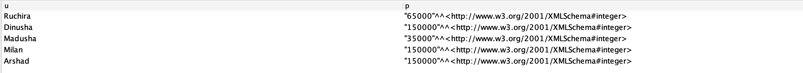

# 手机类别本体

## 执行的查询语句

- 找到用户和对应的价格

```
SELECT ?u ?p
WHERE {
    ?s <https://www.gsmarena.com/ontologies/mobile.owl#hasPrice> ?p.
    ?u <https://www.gsmarena.com/ontologies/mobile.owl#uses> ?s.
}
```

查询结果：



- 根据品牌和操作系统推荐手机型号

```
PREFIX rdfs:<http://www.w3.org/2000/01/rdf-schema#>
                            SELECT ?model
                            WHERE {
                            ?model rdfs:subClassOf <https://www.gsmarena.com/ontologies/mobile.owl#SmartPhone>.
                            ?mi a ?model.
                            ?b a <https://www.gsmarena.com/ontologies/mobile.owl# AMOLED.
                            ?o a <https://www.gsmarena.com/ontologies/mobile.owl# os.
                            ?mi <https://www.gsmarena.com/ontologies/mobile.owl#hasBrand> ?b.
                            ?mi <https://www.gsmarena.com/ontologies/mobile.owl#hasOS> ?o.
                            }
```


- recommend phones based on chipset

- 根据年龄组推荐
